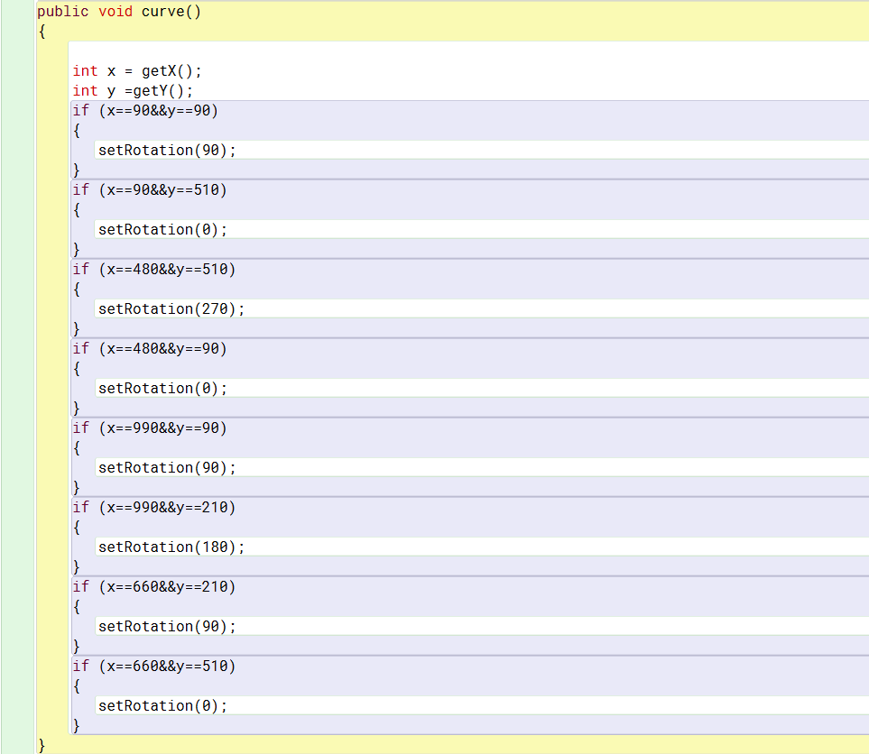
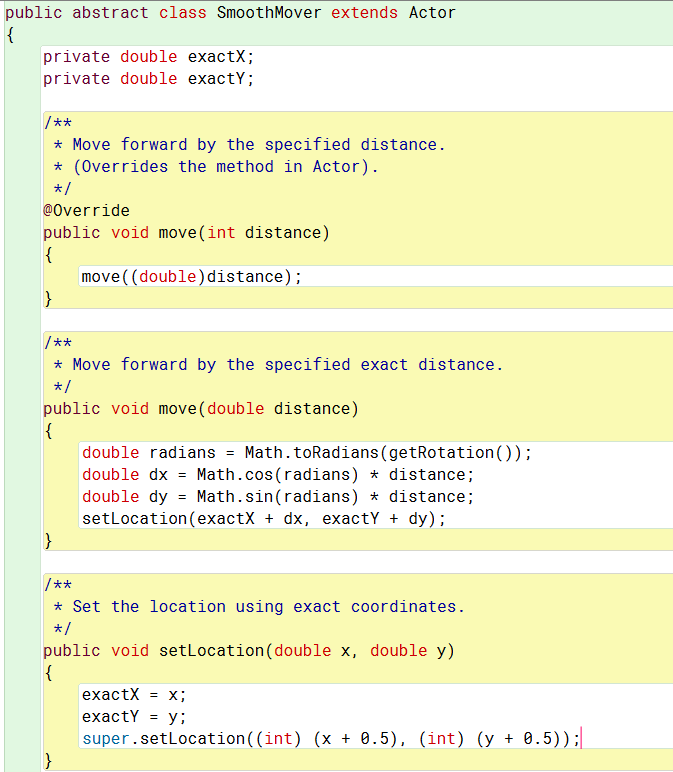
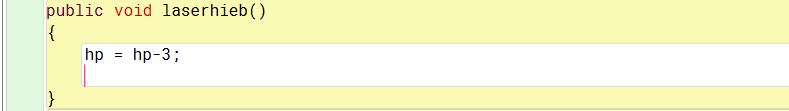
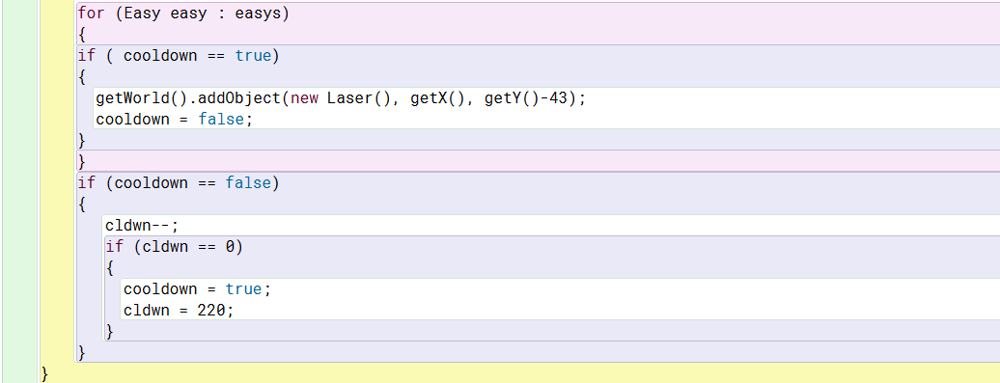
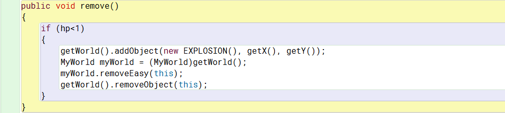
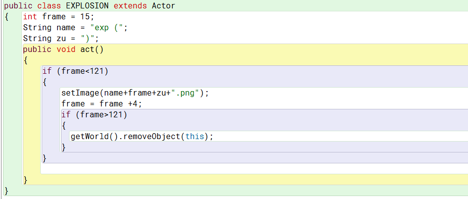
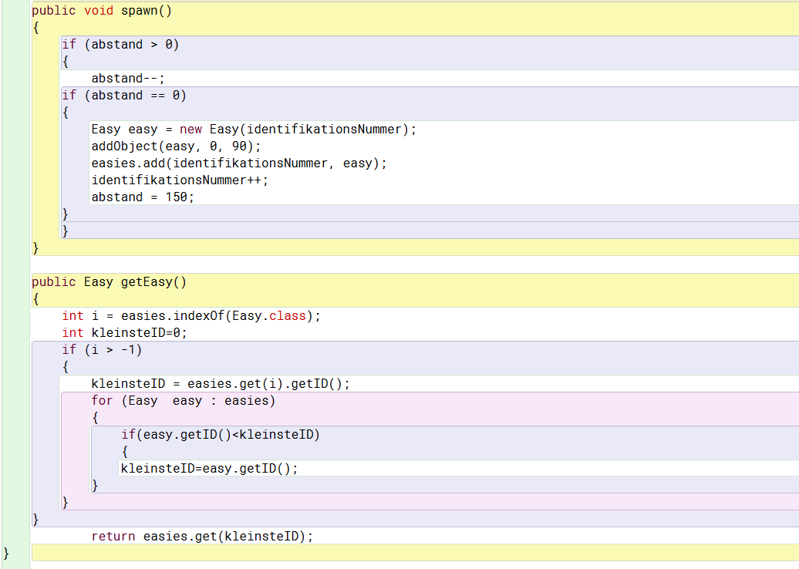
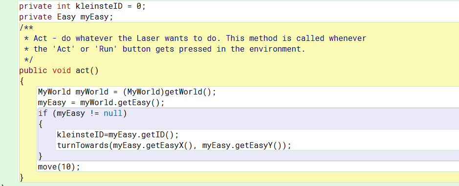

Informatikprojekt: Tower-Defence
=
## Vorwort
Im Rahmen des Informatikunterrichts haben wir, Kaan Huperz und Tom Heuser, uns dem Projekt gewidmet ein "Tower-Defence" 
Minispiel zu entwickeln. Im Folgenden stellen wir dieses Projekt vor. Dabei ist wichtig zu erwähnen, dass das hier vorgesellte
nicht das fertige Projekt ist, da noch Zeit zur Fertigstellung zur Verfügung steht. 

## Was ist überhaupt "Tower-Defence"?
Unter dem Begriff "Tower-Defence" versteht man eine eine Unterart der Echtzeit-Strategiespiele. Das Grundprinzip dieser Spiele
geht folgendermaßen: In der Spielwelt laufen verschiedene Angreifertypen einen festgelegten Weg ab. Ziel ist es mit taktisch klugen 
Positionierungen von Abwerhrtürmen (Turrets) die Angreifer daran zu hindern. Dabei stehen meist verschiedene Turm-Arten 
zur Verfügung. 

## Unser Projekt:
Für ein Tower-Defence Speil benötigt man zunächst erstmal die Gegner, die einen festgelegten Pfad ablaufen. Dazu erstellten wir 
einen Actor und ließen ihn von der Welt immer am gleichen Ort spawnen. Dann gaben wir ihm eine Richtung und eine 
Bewegungsgeschwindigkeit. Nun haben wir einen bestimmten Punkt auf seinem Weg festgelegt, an dem er sich dreht und in eine andere
Richtung weiterläuft. Dieses Verfahren haben wir fortgesetzt, bis unser gewünschter Pfad entsteht. 

Da wir mit der Geschwindigkeit nicht zufrieden waren, haben wir den Smooth-Mover verwendet, um die Geschwindigkeit weiter 
reduzieren zu können. 

Nun laufen alle Gegnereinheiten auf unserem gewünschten Pfad in gewünschter Geschwindigkeit. Als nächstes braucht man die 
Abwehrtüme. Diese sollten sich durch Eigenschaften wie Reichweite, Schaden, Feuerrate unterscheiden. Diese Eigenschaften 
legten wir wie folgt fest:

Reichweite:

Schaden:

Feuerrate:

Um den Schadensaspekt überhaupt verwenden zu können, brauchen unsere Gegner auch eine Anzahl an Lebenspunkten:

Wenn nun ein Gegner mit einem Projektil eines Turrets kollidiert wir ihm die Anzahl an Lebenspunkten abgezogen, die das 
Projektil an Schaden verursacht. Sobald er weniger als einen lebenspunkt hat wird er aus der Welt entfernt:

Dabei haben wir dem noch eine kleine Explosionsanimation hinzugefügt:

Dait hat man schon den groben Ablauf des Spiels fertig, es exsistiert jedoch noch ein maßgebliches Problem: Die Turrets 
fokussieren einen einzelnen Gegner, bis dieser ausgeschaltet wurde, sondern feuern immer auf den letzten, der in ihre Reichweite
tritt. Dieses Problem haben wir folgendermaßen gelöst: Zunächst geben wir jedem gegner eine unterschiedliche 
Identifikationsnummer, wobei diese chronologisch zugewiesen wird, d.h. der erste hat die Nummer 0 der zweite 1 der dritte 2 usw.
Dann haben wir eine Liste erstellt in die alle Gegner hinzugefügt werden, die in die Reichweite des Turrets treten. In dieser
Liste wird dann geckuckt welcher Gegner die kleinste Id hat und dieser wird herausgegeben. Das Projektil kann nun diese 
Information benutzen, um das richtige Ziel anzutreffen.

